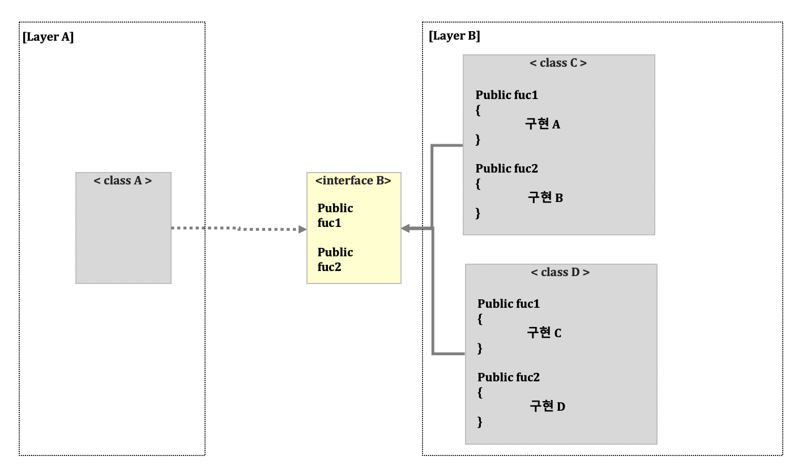
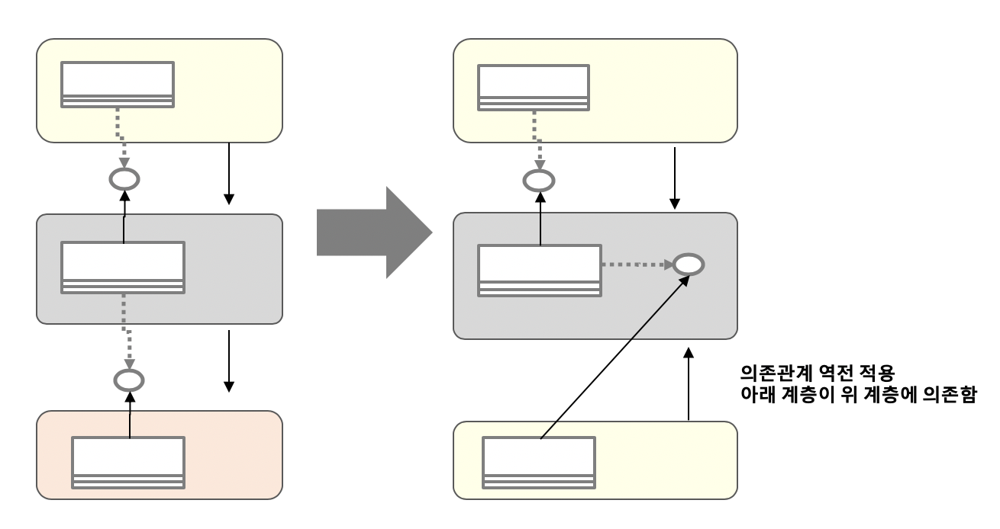
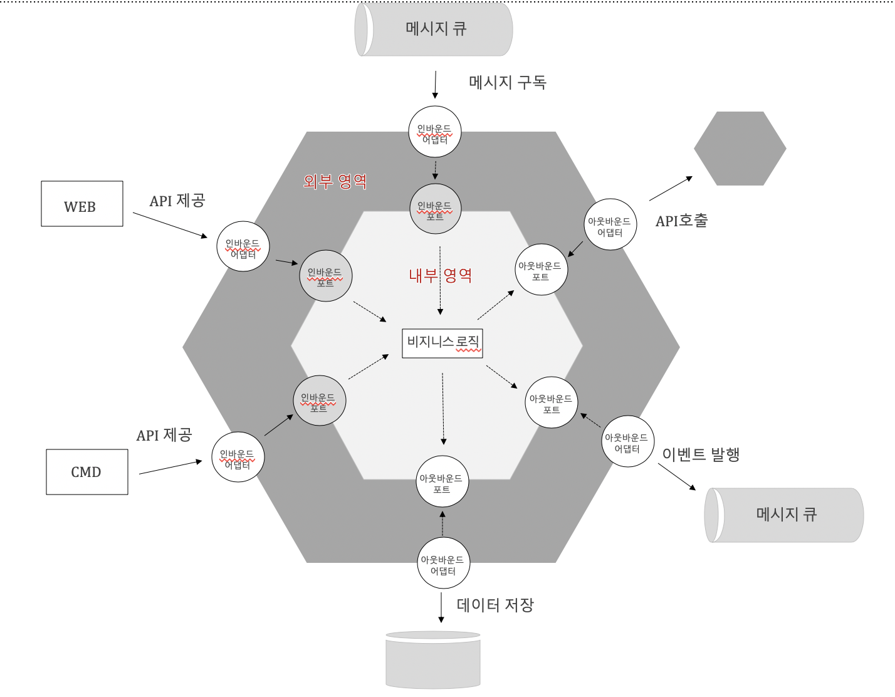
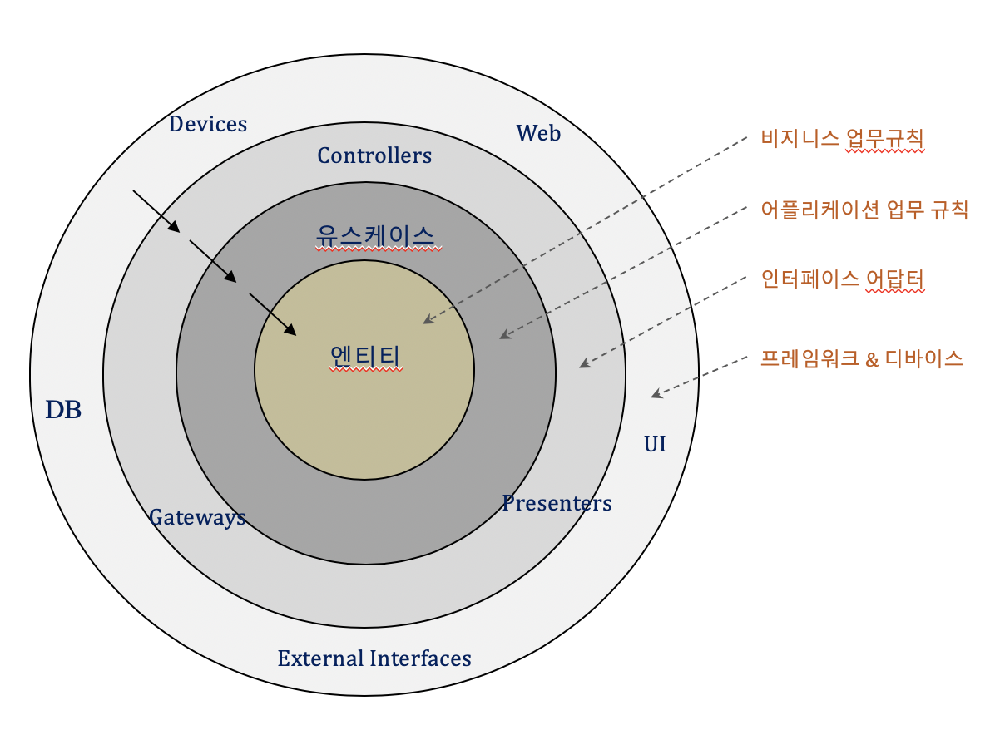
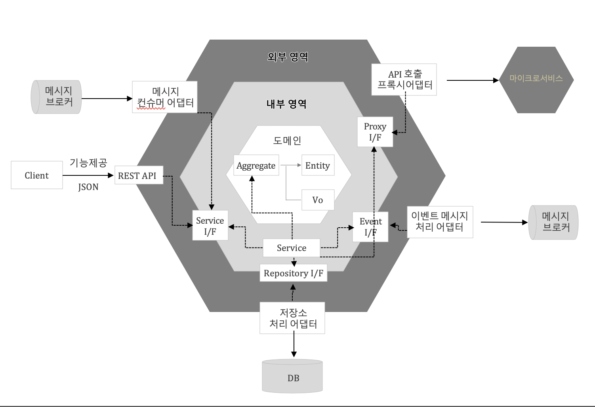
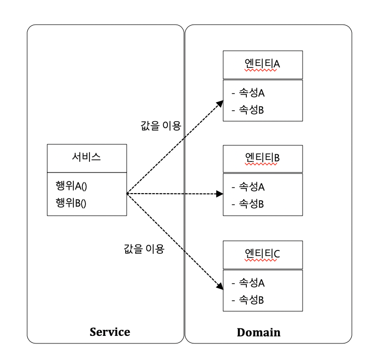
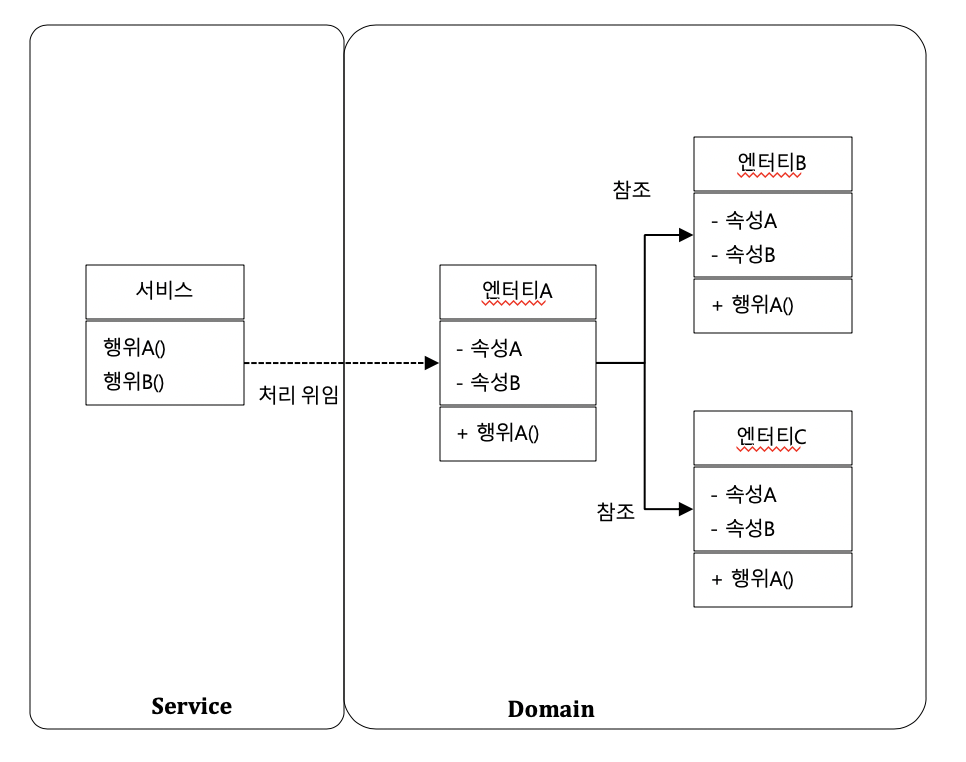
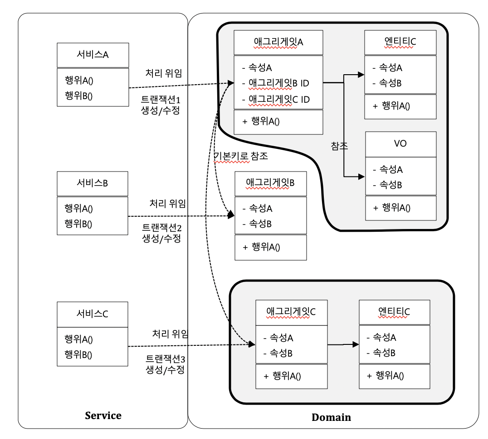

#3장 마이크로서비스 애플리케이션 아키텍처

> 소프트웨어의 가치는 행위 가치와 구조 가치로 나뉘고, 소프트웨어를 정말로 부드럽게 만드는 것은 구조 가치다 - <<클린 아키텍처>>

- 행위 가치 : 소프트웨어의 기능을 말한다
- 구조 가치 : 소프트웨어 아키텍처를 말한다.

기능구현에만 초점을 맞춘 소프트웨어는 전혀 소프트하지 않다. 아키텍처가 좋은 소프트웨어가 진짜 소프트한 소프트웨어다.
유연한 소프트웨어는 지속적 비즈니스의 변화에 대응을 할 수 있고, 기민하게 대응할 수 있게 한다 = 마이크로서비스 아키텍처의 장점.

1. 국내 많이 발생하는 소프트웨어 아키텍처의 문제점을 살펴보고,
2. 바람직한 애플리케이션 아키텍처 아이디어를 알아본 후, 아이디어가 마이크로서비스와 어떻게 접목 되는지 살펴보고,
3. 마이크로 서비스 내부 설계시 고려해야할 각종 애플리케이션 패턴을 살펴보자.

## 1. 비즈니스 로직은 어디에? - 관심사의 분리
***비즈니스 로직***
- 소프트웨어의 핵심이라고 많이 말한다.
- 보통 비즈니스 영역의 업무 규칙, 흐름, 개념을 포현하는 용어다.
- 개발자의 역할은, 비즈니스 로직을 분석 및 이해하고, 프로그래밍 언어란 도구로 잘 표현하는 일이다.
    - = 업무규칙, 흐름, 개념을 이해하기 쉽고 변경 하기 쉬운 코드를 작성하는 일이라고 할 수 있다.

***관심사 분리***
- 관심이란 소프트웨어의 기능이나 목적을 의미한다.
- 관심을 분리한다는 것은, 관심과 관련된 코드를 모아 독립적인 모듈로 만들어, 영향을 덜 받게 하는 것이다.
- 즉, 시스템의 각 영역이 처리하는 관심사가 분리되어 서로 영향을 덜 받기 때문에 관리하기 편함을 의미한다.
- 이 원칙은 시스템을 이해하고 변경하기 쉽게 만들어 준다.
- 모듈화 및 계층화도 관심사 분리 원칙에 기인한다.

비즈니스로직과 기술영역은 철저하게 분리하는 것이 좋다. = 서로의 관심을 따로 분리하는것이 좋다.

    - 🤚 simple 사례: 쇼핑하기 개념에서 다같이 생각해보자 ( ex. 상품 검색.. 상품 검색 조건은 비즈니스.. 클라이언트 호출은 기술..?)
    - 🤚 헥사고날 아키텍처/ 클린 아키텍처에서 비즈니스로직과 기술영역이 아키텍처 구조로 인해 분리되는지 생각해보기
- 기술과 비즈니스 로직을 분리 했을 때 복잡석이 낮아지고 유지 보수성도 높아진다.
- 객체지향 분석설계에서는 비즈니스 로직을 누가 봐도 이해하기 쉽게 구조화하는 객체 모델로 표현하는 것을 강조했다. 
    - OOAD: Object Oriented Analysis and Design

### 국내 소프트웨어 업계의 모습

유행의 종류

MDD
- 개발 생산성 강화라는 그럴듯한 명목에 설계모델을 기반으로 MDD 유행이 있엇다 
    - Model Driven Development: 플랫폼 독립 모델을 플랫폼 상세 모델로 변경하는 과정에서 순수 분석 모델에 특정 플랫폼의 기술을 붙여서 만든다. 
    - 이러한 코드는 매우 복잡하고, 특정 기술에 종속적일 수 밖에 없다. 업무를 이해하려면 리버스 엔지니어링을 통해 코드를 모델로 변환해서 검토해야하고, 비즈니스 변경을 위해 모델을 수정한 후 다시 코드로 생성하는 과정을 거쳐야 하는 번거로음이 있따.
    - 우리나라 금융권에서 사용되던 방식인듯. 배경은 기술의 복잡화(상호 운영성 결여, 소프트웨어 개발 어려움, 이식성 부족), 서비스환경의 다양화, 기술의 급격한 변화 등이 있다고 한다.
    
전자정부표준 
- 정부 주도하 정보화 사업에 사용하기 위해 오픈소스 기술을 활용해 만든 정부 주도 프레임 워크
- 순수한 자바 객체(POJO) 지향하는 스프링 기반으로 만들었는데
- 사실상 객체지향을 그렇게 중요하게 고려하고 있지 않다.
- 모든 비즈니스가 데이터 질의 구문인 SQL에 지향되는 개발을 하게 된다
- 비즈니스로직이 SQL에 중심이 되어있고, 서비스코드는 흐름제어만 헤게된다.
- DB가 병목이 되어 지속적 개발이 어려워 지는 이슈가 있다.

### 3.1 데이터베이스 중심 아키텍처의 문제점
데이터베이스 중심 아키텍처
- 관계형 데이터베이스에 의존한 데이터 모델링을 수행한 다음, 물리 테이블 모델을 중심에 두고 애플리케이션을 구현하기 위한 사고를 하는 방식.
- ex. 컨트롤러/ 서비스 / 레퍼지토리(DB IO), DTO, SQL 매퍼를 사용함.
- 서비스는 제어흐름만 하게되고, SQL 질의에 비즈니스가 의지된다.
- `트랜잭션 스크립트` 구조와 비슷하다.
    - 서비스에서 절차적으로 비즈니스 호출, 모델은 데이터 저장소로써의 역할만 수행.

단점
1. 데이터베이스 중심 아키텍처에서는 저장소를 바꾸고 싶어도 쉽게 변경할 수 없다. 비즈니스로직과 저장기술이 끈끈하게 붙어있기 떄문이다.
2. 대부분의 성능을 데이터베이스에 의존한다. 데이터가 늘어남에 따라 성능은 지속적으로 떨어지고 최족화 방법으로는 스케일업/ 쿼리튜닝이다.
3. 클라우드 시대에서는 인프라를 유연하게 이용할 수 있고, 선택지가 다양한데 관계형 db만 고려할 방법은 문제해결에 적절치 않다.

---

## 2. 헥사고날 아키텍처와 클린 아키텍처
- 전통적인 레이어드 아키텍처
- 최근 헥사고날 아키텍처
- 클린아키텍처

### 2.1. 레이어드 아키텍처
- 논리적으로 3계층 으로 나누어 구성 (presentation , business logic, data access) -> 컨트롤러, 서비스, 레퍼지토리
- 레이어드 아키텍처의 규칙
    - 상위 계층이 하위계층을 호출하는 단방향성 유지
    - 상위 계층은 하위 계층 바로 밑 계층만 활용 ( 프레젠테이션 -> 서비스 / 서비스 -> 데이터 O, 프레젠테이선 -> 데이터 X)
    - **상위 계층이 하위 계층에 영향을 받지 않게 구성**
    - 하위 계층은 상위 계층을 알지 못하게 구성.
    - 인터페이스를 통해 호출함이 바람직함 -> 다형성을 추구함.

- 인터페이스를 통한 접근은 DIP를 만족하는 것 처럼 보이지만,
- OCP는 만족하지 못한다. ( OCP - Open Close Principal). 확장에는 열려있고 변화엔 닫쳐 있어야 한다.
- OCP에 위반되는 까닭은 **모든 계층이 자신이 제공하는 기능에 대한 추상 인터페이스를 직접 정의하고 소유하고 있는 구조기 때문이다**
    - = 상위 계층이 하위 계층에 영향을 받지 않게 구성함이라는 규칙에 어긋난다.
- 코드의 흐름이 상-> 하로 흐른다. 그래서 제어 흐름대로 의존성 방향이 따른다.
- 상위 계층이 하위계층에서 정의한 특성에 영향을 받게 된다.
- 구현체 클래스가 변경된 경우 상위 클래스가 영향을 받지는 않겠지만, 인터페이스가 변경되게 되면 비즈니스 로직 클래스가 엑세스 계층에 의존되기 때문에 변경에 영향을 받는다.

***레이어 엑세스 인터페이스의 위치가 문제다***

- 데이터 엑세스 레이어에서 정의한 인터페이스를, 비즈니스 로직 계층으로 옮긴다.
    - = 데이터 엑세스 계층에 구현해야 할 인터페이스를, 고수준의 비즈니스 로직에서 정의함으로써, 의존방향을 역전시켜 저수준 영역에서 영향 받지 않도록 하는 것이다.
    
### 2.2. 헥사고날 아키텍처
- 레이어드 아키텍처에 DIP를 적용해도 한계가 있다. 현대 애플리케이션에서는 다양한 인터페이스를 필요로 한다
    - = 애플리케이션과 상호작용 하는 다양한 저장소가 존재한다. 다방면으로 열려있는 아키텍처로 문제해결이 필요하다.
- 헥사고날 아키텍처 = **포트 앤드 어댑터** 아키텍처 라고도 한다.

헥사고날 아키텍처 구성

- 내부영역
    - 고수준 비즈니스 로직을 포현함
    - 외부영역과 연계되는 포트를 가지고 있다.(인바운드포트/아웃바운드포트)
        - 인바운드 포트: 내부 영역의 사용을 위해 표출된 API이고, 외부영역의 인바운드 어댑터가 호출함
        - 아웃바운드 포트 : 내부영역이 외부를 호출하는 방법을 정의하고, 아웃바운드 어댑터가 아웃바운드 포트에 의해 구현됨.
- 외부영역
    - 저수준의 외부영역을 담당
    - 외부에서 들어오는 요청을 처리하는 인바운드 어댑터
        - e.g. 스프링 MVC 컨트롤러, 커맨드 핸들러, 메세지 구독 핸들러
    - 비즈니스 로직에 의해 호출되어 외부와 연계되는 아웃바운드 어댑터로 구성된다.
        - e.g. DAO, 메세지 발행 클래스, 외부 서비스 호출 프록시

### 2.3. 클린 아키텍처

- 헥사고날 아키택처의 아이디어와 매우 비슷하다.
- 구조가치( 소프트웨어 아키텍처 )를 부드럽게 유지하는 방법이 무었일까? 
    - 구조 중, 선택할 수 있는 것을 가능한 오랬동안 열어 두는 것이고. 열어둬야할 사항은 중요하지 않은 세부사항 이다.
    - ⁉️ 선택할 수 있는 것은, 기술이나 프레임워크,저장소,같이 변경 가능한 것들.. 선택할 수 없는건 핵심 비즈니스 로직..?
- 클린아키텍처에서는 중앙에서부터 엔티티, 유스케이스, 세부사항으로 구분한다
    - 엔티티 (비즈니스 업무 규칙) 특징
        - 수동으로 처리할 수 있지만, 시스템으로도 자동화 할 수 있는 것.
        - e.g. 쇼핑몰 물건을 사고파는 규칙, 은행이자 계산, 대출/.반납 등
        - 본질적으로 데이터와 결합돼 있어, 객체로 쉽게 만들 수 있고 테스트 할 수 있는 객체들
    - 유스케이스 특징
        - 애플리케이션 특화된 업무규칙을 표현하며, 핵심 업무규칙을 호출하고 제어한다
        - 엔티티는 유스케이스를 알면 안된다. 간단한 객체여야 한다. 프레임워크 데이터베이스등에 의존해서는 안된다. 유스케이스 객체를 통해서만 조작해야 한다.
    - 세부사항 특징
        - 세부사항은 유스케이스를 감싸고 있는 모든 영역을 말한다 (입출력 장치, 저장소, 웹 시스템, 서버, 프레임워크, 통신 프로토콜)
        - 세부사항과 유스케이스의 관계를 DIP를 이용해 플러그인 처럼 유연하게 처리해야 한다.

---
## 3. 마이크로서비스의 내부 구조 정의

### 3.1. 바람직한 마이크로 서비스 내부 아키텍처: 클린 마이크로서비스

세가지 아키텍쳐(레이어드, 헥사고날, 클린)의 지향하는 바를 통해 클린마이크로서비스의 구조를 정의해보면, 앞의 원칙들을 정리할 필요가 있다.

1. 지향하는 관심사에 따라 응집성을 높이고, 관심사가 다른 영역은 의존성을 낮추게 해야한다.
2. 업무 규칙을 정의하는 비즈니스 로직 영역을 다른 기술 기반 영역으로부터 분리하기 위해 노력한다.
3. 세부기술 중심, 저수준의 외부영역 /  핵심업무 규칙이 정의된 구수준의 내부영역으로 분리
4. 고수준 영역은 저수준 영역에 의존하지 않게 하며, 저수준 영역이 고수준 영역에 의존하게 해야한다.
5. 저수준 영역은 언제든지 교체, 확장 가능해야 하며. 이 같은 변화가 고수준 영역에 영향을 줘선 안된다.
6. 자바처럼 인터페이스&추상클래스를 지원하는 언어의 경우 저수준 영역의 구체 클래스가 고수준 영역의 추상 인터페이스에 의존하게 하는 의존성 역전 원칙을 적용한다.
7. 인터페이스는 고수준의 안정된 영역에 존재해야하며, 저수준의 어댑터가 이를 구현한다.

### 3.2. 내부영역 - 업무 규칙

서비스 구현체, 서비스인터페이스(IF), 도메인, 레퍼지토리 IF, 이벤트 IF, 프록시 IF 존재
- 서비스 IF : 외부 영역에 내부를 감추도록 함, 클라이언트의 사용 편의성도 높여줌 ( mock )
- 레포,이벤트,프록시 IF : DIP 원칙을 지원함. 저수준의 외부 어댑터가 인터페이스를 구현하게함.
- 서비스와 도메인 : 클린 아키텍처의 유스케이스, 엔티티 역할을 한다. 도메인은 비즈니스 계증을 표현, 서비스는 도메인을 활용해 시스템 흐름 처리한다.
    - 서비스는 유스케이스를 처리하는 애플리케이션 서비스에 가깝다 ( 도메인의 활동이나 행위를 처리하는 서비스 X )

***트랜잭션 스크립트 패턴 ( - 서비스와 도메인 관계를 구현할 때 참고할 만한 패턴 )***

- 도메인 객체가 행위를 가지고 있지 않고, 무언가를 수행하는 책임은 서비스가 가지고 있다.
- 도메인은 객체 정보의 묶음으로써의 역할이 가깝다.
- 서비스가 유스케이스 처리 단위이고, 때문에 중복되는 코드가 계속 생겨날 수 있다. ( 쇼핑하기.. 전시 로직 같다요..)
- 절차지향식 프로그래밍과 방법이 같기 때문에, 비즈니스에 쉽게 적용할 수 있다.
- 간단한 비즈니스를 처리할 때 도움이 된다.

***도메인 모델 패턴***

- 도메인이 객체 데이터 뿐 아니라 행위를 가지고 있고, 도메인 객체가 소유한 데이터는 도메인 객체가 제공하는 행위에 의해 은닉된다.
- 서비스는 비즈니스 유스케이스를 구현하기 위해 서비스 행위의 일부를 도메인에 위임해 처리한다.
- 도메인 모델은 객체지향 설계의 객체모델이다.
- 더 진화해서 애그리거트 패턴을 적용할 수 있다.
- 복잡한 로직이 많은 마이크로서비스의 구조로 선택하는 것이 좋다.

***도메인 주도 설계의 애그리거트 패턴***

- 애그리거트: **개념적으로 묶인 엔티티의 모음 전체를 지칭한다.**
- 객체 모델링의 `단점`을 보완한 패턴이다
    - 도메인 모델링의 객체간 관계를 객체 참조로 표현하는데, 비즈니스가 복잡해 질 수록 다단계 계층구조가 생기고 복잡한 관계가 발생하고, 무거워진다.
    - 도메인 내부의 경계를 불명확 하다.
    - 도메인 모델 패턴의 문제를 해결하기 위해, 최상위에 존재하는 엔티티를 중심으로 개념의 집합을 분리한다.
- 애그리거트 패턴은 다음과 같은 규칙을 부여한다.
    - 애그리거트 루트만 참조한다.
    - 애그리거트 내 상세 클래스를 바로 참조하지 않고, 루트를 통해 참조해야 한다.
    - 애그리거트 간의 참조는 객체를 직접 참조하는 대신 기본 키를 사용한다.
    - 깁노키를 사용하면 느슨하게 연관되고, 수정이 필요하지 않은 애그리거트를 함꼐 수정하는 실수를 방지한다.
    - 하나의 트랜잭션으로 하나의 애그리거트만 생성, 수정한다.

### 3.3. 외부영역
API 퍼블리싱 어댑터, API 프락시 어댑터, 도메인 이벤트 발행 어댑터, 저장소 처리 어댑터, 도메인 이벤트 핸들러
- 내부영역의 서비스 IF를 사용하는 인바운드 어댑터와 내부영역에서 선언한 아웃바운드 IF를 구현하는 다양한 어댑터로 구성한다.
- 어댑터는 플러그인 처럼 교체되거나 확장될 수 있어야 한다.
- 내부영역이 먼저 정의된 후에 외부 영역의 세부사항은 늦게 정의되도 상관 없도록 해야한다.

API퍼블리싱 어댑터
- REST API를 발행하는 인바운드 어댑터. 서비스 인터페이스를 호출해 REST 형식의 API를 제공한다
- rest 리소스 명청을 정의, 올바른 인터페이스 호출, **응답 DTO 변환 및 매핑해 전달함**
    - controller

API 프락시 어댑터
- 아웃바운드 어댑터
- 내부 영역에서 정의된 프락시 인터페이스를 구현, 다른 API를 호출하거나 soap(simple object access protocol - http,smtp...) 사용

저장소 처리 어댑터
- 아웃바운드 어댑터 구현. 데이터 처리 메커니즘을 선택할 필요가 있다.
- ORM 또는 sql mapper 사용. 

도메인 이벤트 발행 어댑터
- 어떤 사전에 따른 상태의 변경 사항을 말함. 컨슈머에게 전달되기 위해 도메인 이벤트 발행 어댑터를 통해 제공한다.
- 애그리거트 패턴을 적용할 경우, **애그리거트에서 발생한 사건이 된다.**
    - 도메인 이벤트를 빠르게 파악하려면 코드의 어느부분을 바라보는게 맞을까..?
- 도메인 이벤트가 생성되는 위치는 내부영역, 도메인 이벤트 발행 어댑터는 내부영역의 이벤트 IF를 구현해 아웃바운드로 특정 메세지 큐나 스트림 저장소에 발행하는 역할을 수행한다.

도메인 이벤트 핸들러
- 도메인 이벤트를 수신할 수 있는 인바운드 어댑터
- 외부에서 발행된 도메인 이벤트를 구독해서 내부 영역으로 전달하는 일을 수행한다.

## 4. 정리